# Azure Voice AI – Voice-First Virtual Assistant  

This repository demonstrates how to build a **voice-first virtual assistant** using **Azure Communication Services (ACS)** and **Azure AI Voice Live** via real-time WebSocket streaming with Azure OpenAI models.  

---

## 🧪 Prerequisites  

1. **Azure Subscription**  
2. **Azure Communication Services** resource (with a calling-enabled phone number)  
3. **Azure AI Voice Live** resource with a deployed model (e.g. `gpt-4o-mini-realtime-preview`)  
4. **Ngrok or Azure Dev Tunnels CLI** (for exposing local callbacks)  
5. **.NET 8 SDK** (Linux/Mac/Windows)  

   On a new Ubuntu machine:  
   ```bash
   sudo apt update && sudo apt upgrade -y
   sudo apt install -y wget apt-transport-https
   wget https://packages.microsoft.com/config/ubuntu/22.04/packages-microsoft-prod.deb -O packages-microsoft-prod.deb
   sudo dpkg -i packages-microsoft-prod.deb
   sudo apt update
   sudo apt install -y dotnet-sdk-8.0
   ```

---

## 🚀 Setup Instructions  

### 1. Clone this repository  
```bash
git clone https://github.com/p0mmy1978/Azure-Voice-AI.git
cd Azure-Voice-AI
```

---

### 2. Configure environment settings  

Use `appsettings.json` or environment variables.  
You can copy and rename the provided template:  

```bash
cp appsettings.example.json appsettings.json
```

Then update the values:  

```json
{
  "AppBaseUrl": "https://***.devtunnels.ms",
  "AcsConnectionString": "endpoint=https://***.communication.azure.com/;accesskey=***",
  "AzureVoiceLiveApiKey": "***",
  "AzureVoiceLiveEndpoint": "https://***.cognitiveservices.azure.com/",
  "VoiceLiveModel": "gpt-4o-mini-realtime-preview",
  "SystemPrompt": "You are the after-hours voice assistant for poms.tech.",

  "GraphTenantId": "***",
  "GraphClientId": "***",
  "GraphClientSecret": "***",
  "GraphSenderUPN": "terry@poms.tech",

  "StorageUri": "https://***.table.core.windows.net",
  "StorageAccountName": "***",
  "StorageAccountKey": "***",
  "TableName": "StaffDirectory"
}
```

---

### 3. Set up and start a Dev Tunnel (or Ngrok)  

Install DevTunnel CLI:  
```bash
curl -sL https://aka.ms/DevTunnelCliInstall | bash
```

Login and create a tunnel:  
```bash
devtunnel user login
devtunnel create --allow-anonymous
devtunnel port create -p 49412
devtunnel host
```

---

### 4. Register ACS Event Grid Callback  

1. Go to **Azure Portal → Communication Services → Event Grid → Event Subscriptions**  
2. Subscribe to **IncomingCall** events  
3. Set the endpoint URL to your tunnel domain:  

```
https://<your-tunnel-domain>/api/incomingCall
```

---

### 5. Run the app locally  

```bash
dotnet run --project CallAutomation_AzureAI_VoiceLive.csproj
```

---

## ☁️ Deploying to Azure Web Apps  

1. In the Azure Portal, **create a new Web App**:  
   - Runtime: **.NET 8 (LTS)**  
   - OS: **Linux**  

2. Under **Deployment Center**, connect this GitHub repository.  

3. Once deployed, configure **App Settings** in Azure with the same environment variables as in your `appsettings.json`.  

4. Update your ACS Event Grid callback endpoint to point to the deployed Web App:  

```
https://<your-webapp-name>.azurewebsites.net/api/incomingCall
```

---

## 📊 Architecture & Call Flow  

### 🔄 Call Flow Sequence  

```mermaid
sequenceDiagram
    participant Caller as PSTN Caller
    participant ACS as Azure Communication Services
    participant EventGrid as Event Grid
    participant Bot as Voice AI App (Web App / Local)
    participant VoiceLive as Azure AI Voice Live
    participant OpenAI as Azure OpenAI (LLM)

    Caller->>ACS: Dial ACS Phone Number
    ACS-->>EventGrid: IncomingCall Event
    EventGrid-->>Bot: HTTPS Callback (/api/incomingCall)
    Bot->>ACS: Answer Call + Start Media Streaming
    ACS-->>Bot: RTP Audio via WebSocket
    Bot->>VoiceLive: Send audio + get transcription
    VoiceLive->>OpenAI: Forward text → LLM
    OpenAI-->>VoiceLive: AI Response
    VoiceLive-->>Bot: TTS Audio Response
    Bot->>ACS: Send Audio Response
    ACS->>Caller: Plays back AI Response
```



---

# Azure Resource Architecture

```mermaid
graph TD
  Caller["☎️ PSTN Caller"] -->|Dial Number| ACS["Azure Communication Services"]
  ACS --> EG["Event Grid<br/>IncomingCall Event"]
  EG --> App["Voice AI App<br/>(Web App / Local)"]
  App -->|RTP Streaming| ACS
  App --> VoiceLive["Azure AI Voice Live"]
  VoiceLive --> OpenAI["Azure OpenAI<br/>Realtime Model"]
  OpenAI --> VoiceLive
  VoiceLive --> App
  App --> A["Azure Storage Blob"]
  App --> B["Graph API Call to EXO"]
```



---

✅ That’s it — your **Azure Voice AI Assistant** is now fully documented with setup, deployment, environment config, and architecture flow.  
